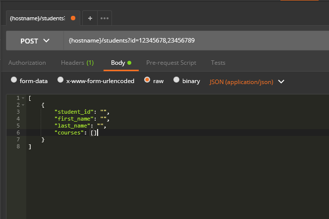

[ app - e - strat ]
---
# What was it?
+++?image=assets/images/workshops-text.jpg&size=contain
+++?image=assets/images/presentations-text.jpg&size=contain
+++
# Size 
...small...

( between 200 and 300 people )
+++
# Community
* Microsoft Developers
* Google Developers
* Smart Bear Developers
* and Various Community Developers
---
# Where was it?
+++?image=assets/images/portland.png
+++
Portland "do"s...
* eat Voodoo Doughnuts.
* hike Forest Park.
* visit Powell's and the Saturday Market.
+++
Portland "don't"s...
* ignore the east side.
* rent a car.
* tip the homeless.
---
# Why did I propose it?
+++
### We need more documentation
* ...that's consistent.
* ...that accounts for various versions across environments.
* ...that's will answer most user inquiries.
+++
### We need a common language
* What's a mediation layer, a translation layer, a transportation layer...?
* How do you define REST endpoints?
* Is it OpenAPI v3, OpenAPI v2, or Swagger?
+++
### We need a way to more quickly diagnose failures?
* How do I trace a specific request?
* How can we analyze requests without needing to change the legacy infrastructure?
* Is it a software or hardware problem?
+++
### etc...
* We should automate more.
* We should standardize to industry security.
* ...and so much more...
+++
### I needed to see how the industry approached these and other API pain points.
---
# How could we be documenting our APIs?
+++ 
We're already using swagger (OAS v2.0)

But were you aware of...
+++
# Swagger CodeGen/Editor?
+++
# Redoc?
+++
# Zally?
---
# How could we be implementing our APIs?
+++
Leveraging openshift continues to become easier and easier...
+++
Service Mesh + Sidecar Proxies


+++
# Distributed Tracing
+++
# retries + circuit breaker pattern


---
# How could we be using our APIs?
+++
We aren't locked into our api standards yet

We could be using the following technologies...
+++
 hypermedia

```
{
    "object": [ "course" ],
    "properties": {
    },
    "actions": [
    	"name": "get_course",
	"title": "Get Course",
	"method": "GET",
	"href": "example.org/course",
	"type": "application/json",
	"fields": [ ... ]
    ]
}
```

+++
### graphQL



+++
### serverless architectures

* early stages of adoption
* useful for singular batch jobs
* removes the need for always on APIs

---
# The Verdict?
+++
* Portland is great!
* The workshops will payoff once istio is past alpha!
* Plenty of tooling to strengthen our weakness.
* I would go again, hopefully as a mentor rather than a mentee.
+++
# tldr
### APIs should be welcoming, holistic, and operable. 
---
# End

